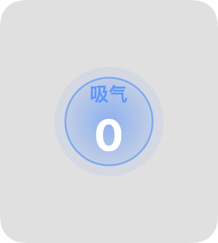
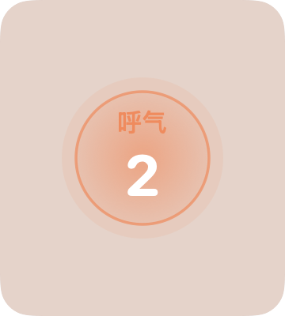

# 🫁 BreatheTool — 呼吸练习悬浮工具

macOS 悬浮置顶的呼吸法练习工具。极简设计，全屏可用。

<p align="center">
  
  
  
</p>

---

## 功能

- 📌 **始终置顶** — 悬浮在所有窗口上方，包括全屏应用
- 👆 **点击即用** — 点击窗口中心开始/暂停，无需任何按钮
- ⏱️ **可调节节奏** — 吸气和呼气时长独立设置（2—10 秒）
- 🎨 **颜色区分** — 吸气蓝色、呼气暖橙色，整窗口随呼吸变色
- 🔍 **可调透明度** — 菜单栏透明度滑块，20%—100% 自由调节
- 🪟 **极简界面** — 无标题栏、无按钮，只有一个呼吸圆环
- 📊 **菜单栏图标** — 所有设置通过菜单栏 🫁 图标完成
- 🖥️ **跨空间显示** — 即使切换到全屏 App 也保持可见

---

## 截图

| 空闲状态 | 吸气中 | 呼气中 |
|:---:|:---:|:---:|
|  |  |  |

---

## 安装

### 推荐：下载 DMG

1. 打开 [Releases](https://github.com/BlackMendrew/Breathe_tool/releases) 页面
2. 下载最新的 `BreatheTool.dmg`
3. 打开 DMG，将 `BreatheTool.app` 拖入 `Applications` 文件夹
4. 首次打开若被阻止，前往 **系统设置 → 隐私与安全性** 中允许运行

### 从源码编译

```bash
# 需要安装 Xcode Command Line Tools
git clone https://github.com/BlackMendrew/Breathe_tool.git
cd Breathe_tool
make
open BreatheTool.app
```

---

## 使用方式

| 操作 | 方法 |
|------|------|
| 开始 / 暂停呼吸 | 点击窗口中心 |
| 移动窗口 | 拖拽窗口任意位置 |
| 显示 / 隐藏窗口 | 菜单栏 🫁 图标 →「显示 / 隐藏」 |
| 调节吸气时长 | 菜单栏 →「吸气」→ 选择秒数 |
| 调节呼气时长 | 菜单栏 →「呼气」→ 选择秒数 |
| 调节透明度 | 菜单栏 → 滑动透明度滑块 |
| 退出 | 菜单栏 →「退出」 |

---

## 技术实现

- **Swift 5.9+** / **SwiftUI** — 界面渲染
- **AppKit** (`NSPanel`) — 悬浮窗口，使用 `canJoinAllSpaces` + `fullScreenAuxiliary`
- **Combine** — 响应式状态管理
- **macOS 14+** — 最低部署版本

### 悬浮窗口原理

```
NSPanel 窗口级别: floatingWindow + 10
collectionBehavior: [.canJoinAllSpaces, .fullScreenAuxiliary, .stationary]
```

确保窗口在所有 macOS 空间（包括全屏应用）中可见。

---

## 许可证

MIT

---

*好好呼吸 ❤️*
